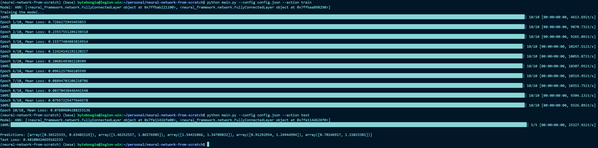
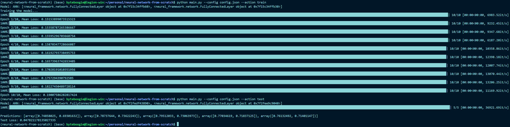

# Neural Network From Scratch

## Description

This is a basic neural framework to train a Deep Neural Network with Fully Connected Layers with an arbitrary input and output size. 

## Capabilities and Caveats

### Capabilities

- Users can choose between two activation functions. Other activation functions (e.g Leaky Relu, Gelu) can be easily integrated in the future.
    - Sigmoid
    - Relu
- Loss Function provided. Other loss functions (e.g Mean Absolute Error, Cross Entropy Error) can be easily integrated in the future.
    - Mean Square Error

### Caveats

- Don't have support for Autograd in this version.
- Gradient accumulation is limited in nature.
- Batched backpropagataion is not implemented yet.

## Directory Structure

```
└── 📁neural-network-from-scratch
    └── .gitignore
    └── CHANGELOGS.md
    └── README.md
    └── 📁assets
        └── sample_usage.png
    └── config.json
    └── env.yml
    └── main.py
    └── 📁neural_framework
        └── __init__.py
        └── activations.py
        └── ann.py
        └── loss_func.py
        └── network.py
    └── setup.py
```

## Installation

- Clone the repository containing the framework code.
  ```
  git clone git@github.com:aninda-ghosh/neural-network-from-scratch.git
  ```

- Create a Conda environment
  ```
  conda env create -f env.yml
  ```

- Install the framework in the created conda environment
  ```
  conda activate neural_framework
  pip install -e .
  ```

## Usage

- Modify the parameters of the model in the [config.json](config.json) file.

- Runing the train script
  ```
  python main.py --config config.json --action train
  ```
  This will save the parameters of the model in a json file for now, which can be loaded later in the test mode.

- Running the test script
  ```
  python main.py --config config.json --action test
  ```
  This will load the model if a file exists in the path given, else an error is raised

#### Sample Usage

**Sample Usage with Relu Activation**



**Sample Usage with Sigmoid Activation**



**Note:** Checkout the [main.py](main.py) to see an example usage in details. Input is currently implicit. Can be switched to loading data in a csv format.

## Changelogs 

**See the Changelogs Here! [Link](./CHANGELOGS.md)** 

#### Guidelines

- Following semantic versioning with ```Major.Minor.Patch```
- Every small changes will come under ```patch``` version. (bugfix, bug)
- Every feature introduction will change the ```minor``` version.
- Every interface logic change will change the ```major``` version.
- Example of the versioning
  - 2.0.005
    - Major version - 2
    - Minor Version - 0
    - Patch Version - 005
  - Always create a new branch for a feature introduction and raise a pull request accordingly.
  - Releases will be tagged either ```Pre Release``` or ```Latest Release``` from the main branch only.
  - Git commits will have the changelogs description as the commit message. e.g. **2.0.005 (feature+update)**
  - Definition of keywords
    - **feature** - Any introduction of a new feature
    - **bug** - With the commited change the system is in a buggy state.
    - **bugfix** - for any patches applied over a bug.
    - **update** - general updates like updating readme. (this won't increment any version numbers)
    - **experimental** - This stays out of the main branch unless the experiment is solidified to create a feature out of it.